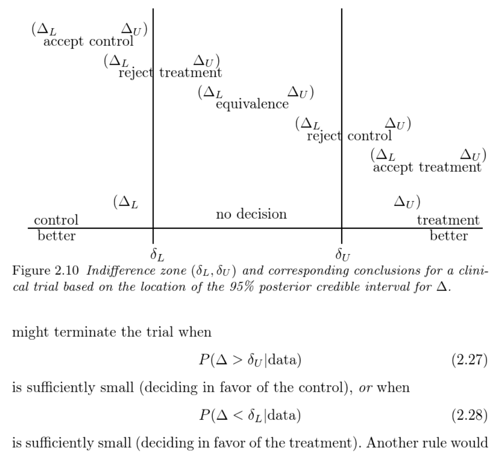

# Chapter 1 Statistical approaches for clinicla trials

## Bayesian versus frequentist appraoches in clincial research

- Key differences
    - parameters
    - inference input data and prior
    - **flexibility**, sequential learning
    - probability statements, predictive probabilities
    - decision theoretic 
    - comment on role of randomization
    
Additional reading
- [Beyond subjective and objective in statistics by Andrew Gelman and Christian Henning](http://www.stat.columbia.edu/~gelman/research/published/gelman_hennig_full_discussion.pdf)
    - Bayesian is no more subjective than frequentist
    - Prior can be used meaningfully both computationally and biologically
    
## Adaptivity

Bayesian is more commonly used for Phase I and Phase II trials. Some appealing adoption including non-fixed sample-size, early stopping and adoptive randomization.

### The book argue "full bayesian" with utility function is awkward.

- the expected utility function given poster distribution of the parameter
- an example utility gain (or loss): Y(Z=1, treated)-Y(Z=0, control)

$$ \int u(\theta, x) p(\theta |x)d\theta $$

### Bayes as a frequentist tool
- flexibility, sequential learning
- posterior predictive probability
- use of prior, borrow info from other studies
- adaptive randomization
- seamless phase II and III design

# Chapter 2 Basics of Bayesian

Additional reading on choice of prior
 - https://github.com/stan-dev/stan/wiki/Prior-Choice-Recommendations
 - http://www.stat.columbia.edu/~gelman/research/unpublished/prior_context_2.pdf
 
Additional reading on model selection (AIC, DIC, WAIC etc):
- [Understanding predictive information criteria for Bayesian models, Gelman, Hwang & Vehtari](http://www.stat.columbia.edu/~gelman/research/published/waic_understand3.pdf)
 
## Principles of Bayesian clincial trial design

Methods which can be used for clinical decision making

1.  Posterior predictive methods
2.  Bayesian indifference zone methods

{width=75%}

3. Use of priors
4. Operating characteristics - Bayesian trial sample size

Additional reading on Bayesian trial sample size

- [Bayesian techniques for sample size determination in clinical trials: a short review](https://doi.org/10.1191/0962280203sm345oa)
- [Using historical data for Bayesian sample size
determination]( https://doi.org/10.1111/j.1467-985X.2006.00438.)
- [Clinical Trials and Sample Size
Considerations: Another Perspective](https://projecteuclid.org/journals/statistical-science/volume-15/issue-2/Clinical-Trials-and-Sample-Size-Considerations-AnotherPerspective/10.1214/ss/1009212752.full)

Some thing interesting to read:
Bayesian and type I error, https://www.fharrell.com/post/pvalprobs/

5. Online Bayesian Phase I and II design apps, https://trialdesign.org/#newsSection

# Discussions

1. Example Bayesian trial, Advanced reperfusion strategies for patients with out-of-hospital cardiac arrest and refractory ventricular fibrillation (ARREST): a phase 2, single centre, open-label, randomised controlled trial, https://doi.org/10.1016/S0140-6736(20)32338-2

 - The use of potentially optimistic treatment effect target belief
 - Cost of using ECMO versus control

2. P-value versus Bayes factor, confidence interval versus credible region. (http://www.utstat.toronto.edu/mikevans/jeffrosenthal/chap7.pdf)

