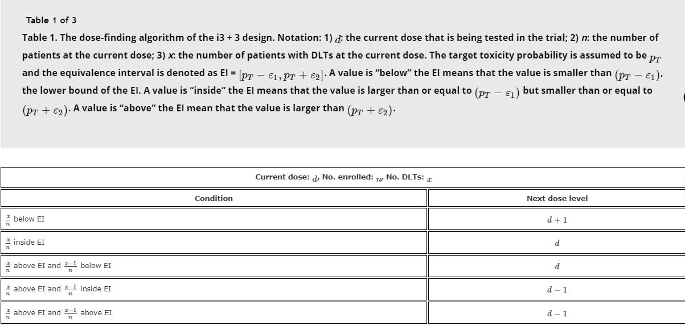
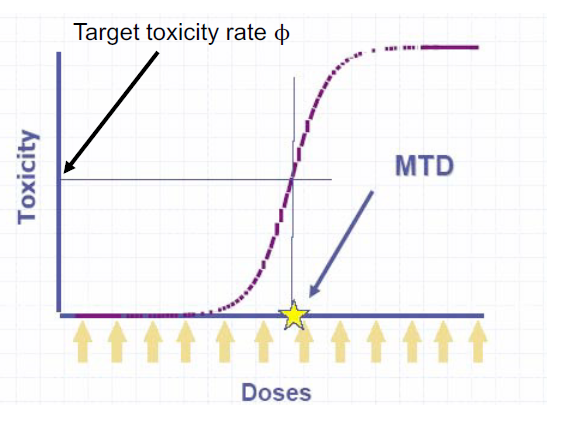
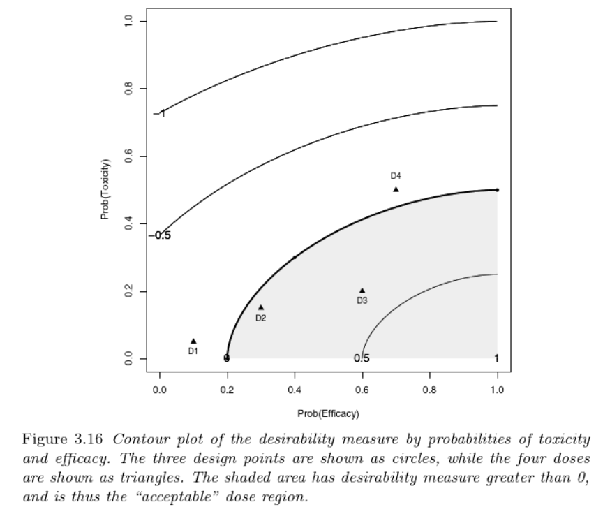
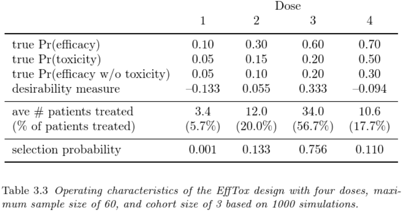

# Chapter 3 Phase I

Generally speaking the Objectives of Phase I study is safety and dosage. This chapter focuses on Phase I methods to identify the maximum tolerated dose (MTD). Key elements of Phase I studies including,

 + (0) study population (healthy volunteers or people with disease)
 + (a) starting dose (e.g. $LD_{10}$)
 + (b) toxicity profile and dose-limiting toxicity (DLT)
 + (c) target toxicity level (TTL)
 + (d) dose escalation scheme (dose increment, dose assignment and cohort size)
    
## 3.1 Rule-based design for determing maximum tolerated dose (MTD)

### 3+3 design (Storer EB, 1989)

- widely used, implementation does not require a computer
- simplicity: dose escalation and de-escalation decisions are based on a set of prespecified rules
- Example 3.2, page 90, 3+3 can be inefficient with low starting dose and small to moderate increment. 

### Pharmacologically guided dose escalation

- considered more efficient then 3+3, but doesn't work for all agents and there are challenges in getting timely pharmacokinetic results.

### Accelerated titration designs and other rule-based designs

- variation of 3+3, allow intrapatient dose escalation - reduce number of patients
- drawbacks: mask of efficacy and toxicity (delayed)

### Other rule-based designs

Newest one, the i3+3 design [(Liu M, 2020)](https://www.tandfonline.com/doi/abs/10.1080/10543406.2019.1636811?journalCode=lbps20). Set of dose $d=1, \ldots, D$ and pre-specified i) target toxicity rate, $p_T$ (e.g., $p_T=0.3$) and the equivalence interval (EI), mathematically as $[p_T - \epsilon_1, p_T + \epsilon_2]$ (e.g., [0.25, 0.35]). EI provides a range around $p_T$ so that doses with toxicity probabilities inside EI are considered as MTD - allows some variabilities.

{width=110%}

### Summary

simple but potentially inefficient.

## 3.2 Model-based designs

These designs assume a monotonic dose-response relationship with defined dose-toxicity curve and target toxicity level. Works well under Bayesian framework.

{width=55%}

### Continual reassessment method (CRM)

- common model for dose-toxicity curve: hyperbolic tangent, logistic, power. Model is updated based on accrued data (Bayesian adaptation)
- more likely to identify correct MTD comparing to 3+3
- Not well-accepted in original format due to safety considerations , if pre-specified model were incorrect.

- online shiny app, https://trialdesign.org/one-page-shell.html#BMACRM

### Escalation with overdose control (EWOC)

- same as CRM except the way it selects each successive new dose
- unlike CRM that select the new dose using the posterior mode or mean, EWOC use the feasibility bound. A feasibility bound $\alpha < 0.5$ corresponds to placing a higher penalty on overdosing than on underdosing.

```{r, message=FALSE}
library(R2jags)
library(runjags)

filename <- "BUGSmodel.txt"
cat("
model{
    for (i in 1:N){
# Likelihood
      Y[i]~dbern(p[i])
      logit(p[i])<- (1/(gamma - Xmin))*(gamma*logit(rho0) 
      - Xmin*logit(theta)+(logit(theta)-logit(rho0))*X[i])
    }  #  end of for loop
# Priors
    gamma ~ dunif(Xmin, Xmax)
    rho0 ~ dunif(0,theta)
  }  #  end of BUGS code

",file=filename
)

# Data (1st patient 140, no tox):
data1<-list(Y=c(0), X=c(140), Xmin=140, Xmax =425, theta=0.333, N=1)

# Data (1st patient 140, no tox; 2nd patient 210, no tox):
data2<-list(Y=c(0,0), X=c(140,210), Xmin=140, Xmax=425, theta=0.333, N=2)	
	
# Data (1st patient 140, no tox; 2nd patient 210, tox):
data3<-list(Y=c(0,1), X=c(140,210), Xmin=140, Xmax=425, theta=0.333, N=2)	
	
# Data (1st patient 140, no tox; 2nd patient 210, no tox;
#   3rd patient 300, no response yet):
data4<-list(Y=c(0,0,NA),X=c(140,210,300),Xmin=140,Xmax=425,theta=0.333,N=3)	
	
#Inits:
init<-list(list(rho0=0.05, gamma=160),list(rho0=0.05, gamma=160))

#First patient;
jags.fit <- jags(data=data1,inits=init,parameters.to.save=c("rho0","gamma"),
         jags.seed = 100, n.iter=11000, model.file="BUGSmodel.txt",n.chains = 2,n.burnin = 1000)

jagsfit.mcmc<- as.mcmc(jags.fit)
summary(jagsfit.mcmc)

#Second patient;
jags.fit <- jags(data=data2,inits=init,parameters.to.save=c("rho0","gamma"),
         jags.seed = 100, n.iter=11000, model.file="BUGSmodel.txt",n.chains = 2,n.burnin = 1000)

jagsfit.mcmc<- as.mcmc(jags.fit)
summary(jagsfit.mcmc)


```

### Time-to-event monitoring (TITE-CRM)

### Quick Summary on CRM based approaches

Pros:

+  Solid statistical foundation
+  Flexible and efficient
+  Better performance than rule-based

Cons:

+  Performance can be compromised when the model is misspecified
+  Need specialized expertise to select prior and model
+  Work like a black box, challenging to communicate with non-statisticians


### Toxicity intervals and Ordinal toxicity intervals


- allow the use of a range of acceptable toxicity levels
- this methods is introduced to incorporate uncertainty in estimating mean toxicities
- does not skip does and stops early for excessive toxicity if the lowest does is found to be excessively toxic


## 3.3 Efficacy versus toxicity

- dose finding incorporating both efficacy and toxicity endpoints
- Use for Phase I/II design, seamless phase I and II
- $EffTox$, [link to software](https://biostatistics.mdanderson.org/SoftwareDownload/SingleSoftware/Index/2), [link to paper](https://www.johndcook.com/efftox.pdf)


Pair of binary outcomes, $(Y_E, Y_T)$ follow with marginal probability in logit form as

$$logit(\pi_T) = \mu_T + \beta_T x$$
$$logit(\pi_E) = \mu_E + \beta_{E,1} x + \beta_{E,2} x^2$$
where x is the dosing variable. The bivariate joint likelihood $P(Y_E=a, Y_T=b \mid \theta)$ captures the dependency between the two outcomes, where $a \in \{0,1\}$, $b \in \{0,1\}$ and $\theta$ presents the vector of parameters.

At each dose update decision, the dose $x$ is acceptable if
$$ P \{ \pi_{E} (x, \theta) \leq \pi_{\bar{E}} (x, \theta) \mid D_n \} > p_E$$ and

$$P \{ \pi_{T} (x, \theta) < \pi_{\bar{T}} (x, \theta) \mid D_n \} < p_T$$ 
$p_E$ and $p_T$ are pre-defined gatekeepers for meeting minimum efficacy and maximum toxicity. Larger $p_E$ more likely to exclude low efficacy doses and larger $p_T$ more likely to exclude excessive toxicity doses.

The utility (desirability measure, the larger the better) of dose x with $\pi_E(x, \theta)$ and $\pi_T(x, \theta)$ - which is used to assess efficacy-toxicity trade-off is

$$ u(\pi_E, \pi_T) = 1 - \Big[ (\frac{1-\pi_E}{1-\pi_E^{*}})^p + (\frac{\pi_T}{\pi_T^{*}})^p \Big]^{\frac{1}{p}}$$
where $\pi_E^{*}$ represents the smallest acceptable efficacy response rate and $\pi_T^{*}$ represents the highest acceptable toxicity level.

{width=80%}

{width=70%}


## 3.4 Combination therapy

- mathematically similar to efficacy and toxicity joint modelling, now we joint model two or more toxicity models for each combination therapy

- Gumbel model, good but might be sensible to changes of the algorithm
- Bivariate CRM
- Combination therapy with bivariate response (toxicity and efficacy)
- Bivariate logistic model

## Additional Readings

0. Review of current Phase I methods (recommanded), https://clincancerres.aacrjournals.org/content/24/18/4357
1. Phase 0 (a proof of principle trial involving small number of patients), https://www.ncbi.nlm.nih.gov/pmc/articles/PMC3902019/
2. Seamless early-phase designs in oncology, https://academic.oup.com/jnci/article/111/2/118/5245491
3. Model-assisted phase I design, Bayesian optimal interval design (BOIN) [(Liu and Yuan, 2015)](https://doi.org/10.1111/rssc.12089)

