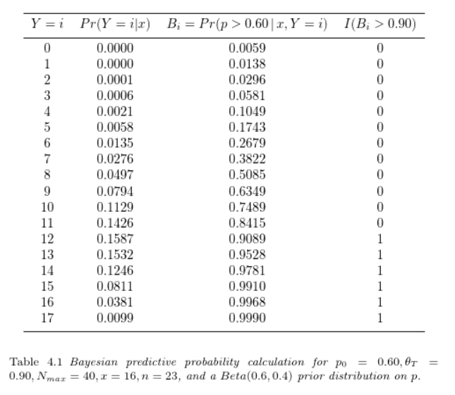
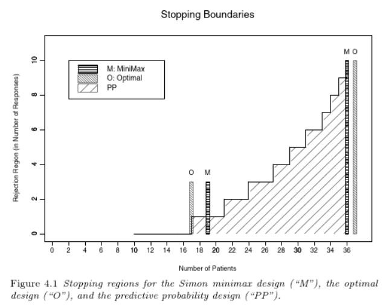

# Chapter 4 Phase II

The primary objectives of Phase II study is to study efficacy. This chapter focuses on Phase II adaptive design methods to evaluate effectiveness, early stopping, and comparing efficacy between several treatment arms.
    
## 4.1 Standard Design - frequentist

### Phase IIA

-  to provide initial efficacy assessment, often designed single-arm, open label.
- binary effective outcomes
-  two-stage optimal designs controlling type I and II errors
  -  a) minimized expected sample size under null hypothesis (on the response rate) 
  -  b) the minimax design, more conservative
-  multi-stage design with early stopping for futility, desireable but is more complicated to design comparing to two-stage

### Phase IIB

- after IIA, a randomized and multi-arm study to select the "winning" regimen.
- time-to-event outcomes
- larger type I and type II errors
- optimal designs
  -  a) conventional design controlling type I&II errors with emphasis on type II error
  -  b) Pick-the Inner design (SWE), control only Type II error, ranking based design works best when there is a true "winning" regimen

- several limitations of these traditional frequentist based design. Flexible, adaptive Bayesian design is desired.

## 4.2 Predictive probability to determine effectiveness and early stopping

Example:

{width=80%}

$$PP=0.1587+0.1532+0.1246+0.0811+0.0381+0.0099=0.5656$$ 

For targeted $\theta_L=0.10$ and $\theta_U=0.9$, PP is between the bounds which means the trial will not be stopped early (prior to 40 max patients) for reasons of ineffective or effective.

### derivation of the predictive process design

- Given type I and type II error constraints, interim data and priors, find $N_max$, $\theta_L, \theta_T, \theta_U$.
- Design with the smallest $N_max$ but still achieve targeted response - similar conceptually to the minimax design

- Allow investigator to monitor the trial
- a minimum number of patients is required to gather reliable response rate before computing PP.

{width=80%}

## 4.2 Sequential stopping

- Binary Stopping for futility and efficacy
- Binary Stopping for futility and efficacy and toxicity

## 4.3 Adaptive randomization and dose allocation

- "Play with the winner" over multiple rct for Phase IIB
- Arms can be categorized into early loser (suspend), early winner, final winner and futility (immediate termination)
- randomization probability is proportional to the posterior probability that an arm dominates another arm given the observed response rate of the two arms.

- can select conservative prior or more liberal stopping rule (higher chance of finding early loser/winner) each will have different impact on the trial's operating characteristics
- design can be prioritized based on number of patients to enrol, duration of the trial, small type I and II error.

- adaptive randomization on treatment arm can also be used for dose finding

- outcome adaptive randomization: making decision before all reponses are observed given existing information

R resources:
-  bayesCT package, [An R package for Simulation in Adaptive Bayesian Clinical Trials](https://cran.r-project.org/web/packages/bayesCT/vignettes/bayesCT.html)

